# Anatomy of a Fake-Recruiter Infostealer Attack — the "Block3 / Werknova" Web3 Job Scam

> A technical incident report and threat analysis of a spear-phishing campaign targeting active job seekers. The lure is a fake Web3 recruiting process; the payload is an **ACRStealer** infostealer disguised as a "desktop meeting app." This write-up reconstructs the full attack chain, analyzes the malware and infrastructure, maps it to MITRE ATT&CK, and documents the defensive controls that contained it.

**Status:** Contained · Payload confirmed malicious · Network exfiltration blocked at the perimeter
**Incident date:** 12 June 2026 (first contact 5 June; re-engagement 16 June)
**Analyst:** Rajdeep Kaur Sandhu

---

## Disclaimer & handling notes

- Defensive security research. No malicious code, payloads, or working samples are included or linked.
- All indicators are **defanged** (`hxxp`, `domain[.]tld`, `1.2.3[.]4`). Do not re-fang and visit them.
- Screenshots have been **redacted** to remove personal identifiers and third-party faces; attacker indicators are preserved intentionally.
- The malware sample is retained **offline**, in an isolated location, inside a password-protected archive, and was only detonated in third-party sandboxes (VirusTotal, Hybrid Analysis).

---

## Executive summary

A purported company, **Block3** (`block3[.]co`), recruited a candidate for a *Web3 Strategy Analyst* role following an application to its LinkedIn listing. The process appeared legitimate: a personalized email, a calendar/booking link, and an interview scheduled on the company's own "meeting platform," **Werknova** (`werknova[.]co` / `werknova[.]app`).

During the scheduled call, the operator ("Emma Martin") asked whether the candidate was on **Windows or Mac**, then claimed the microphone could not be detected and directed installation of the **Werknova desktop app** to continue. The installer, `werknova_setup.msi`, was executed; the host was isolated within minutes.

That MSI is **ACRStealer**, a malware-as-a-service infostealer. It uses **DLL search-order hijacking** against a legitimately-named `draw.io.exe` to load its payload, then beacons to a command-and-control (C2) server (`jarlontravon[.]com`) to exfiltrate browser credentials, session cookies, cryptocurrency wallets, and more.

**Containment:** router-level filtering (Trend Micro Home Network Security) **blocked the C2 connection**, both during the live incident and again during sandbox replay. A Microsoft Defender full scan returned **zero findings** — illustrating that endpoint AV is not a reliable backstop against a fresh, evasive stealer. Because an infostealer executed, all exposed credentials and session tokens are treated as compromised and the host is being rebuilt.

This pattern — fake recruiter → fake interview → "install our app/tool" → infostealer — is one of the most active social-engineering campaigns of 2025–2026, particularly against Web3/crypto job seekers.

---

## The attack chain

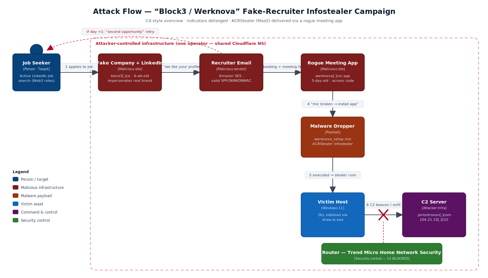

> Editable source: [`attack-flow.drawio`](attack-flow.drawio) — open in [draw.io / diagrams.net](https://app.diagrams.net). (Fittingly, `draw.io` is also the binary the malware abused for DLL sideloading.)

> **SOC-style architecture view:** [`soc-incident-architecture.svg`](soc-incident-architecture.svg) — defense-in-depth layers, the analyst response pipeline, and the reporting / intel-sharing outputs in a single map.

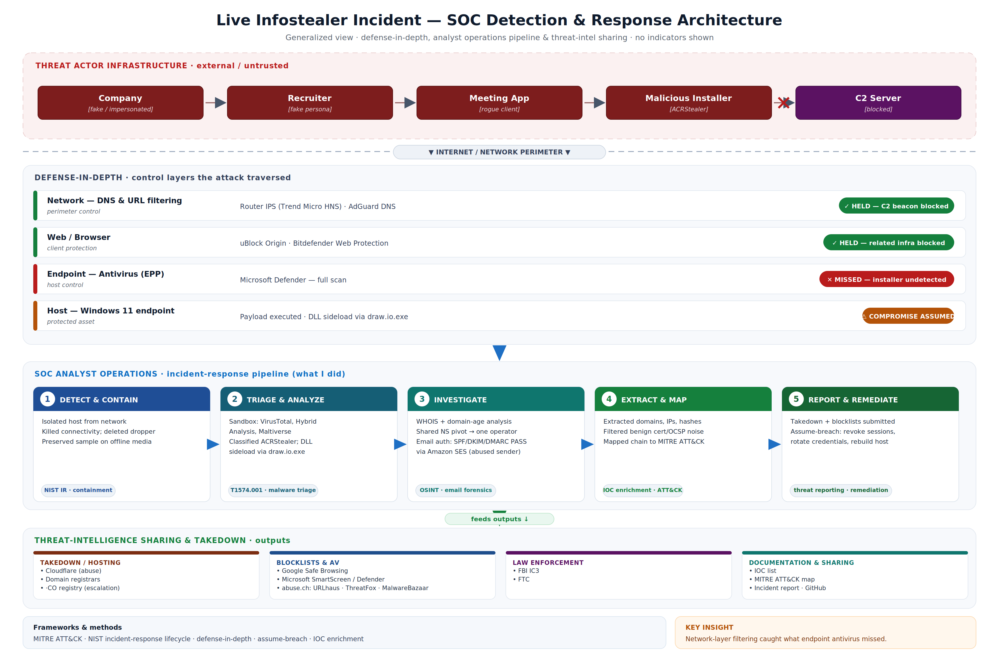

*SOC-style architecture view — defense-in-depth layers (what held vs. what the attack slipped past), the analyst response pipeline, and the reporting / intel-sharing outputs.*

Text version (Mermaid)

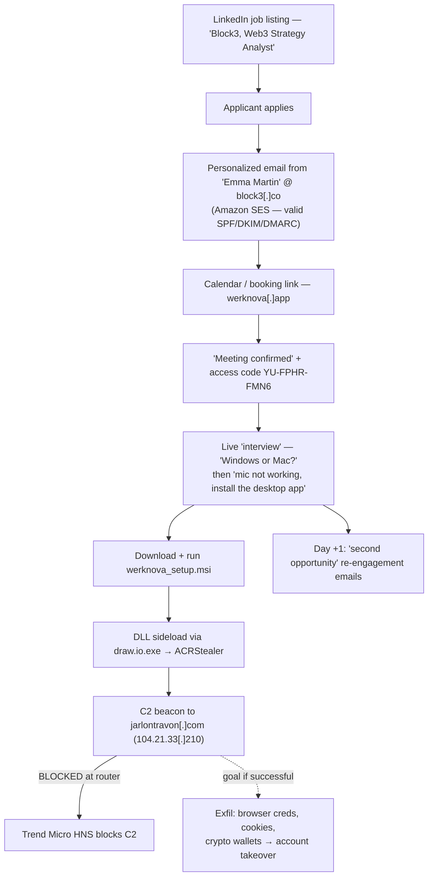
```mermaid
flowchart TD
    A["LinkedIn job listing — 'Block3, Web3 Strategy Analyst'"] --> B["Applicant applies"]
    B --> C["Personalized email from 'Emma Martin' @ block3[.]co<br/>(Amazon SES — valid SPF/DKIM/DMARC)"]
    C --> D["Calendar / booking link — werknova[.]app"]
    D --> E["'Meeting confirmed' + access code YU-FPHR-FMN6"]
    E --> F["Live 'interview' — 'Windows or Mac?'<br/>then 'mic not working, install the desktop app'"]
    F --> G["Download + run werknova_setup.msi"]
    G --> H["DLL sideload via draw.io.exe → ACRStealer"]
    H --> I["C2 beacon to jarlontravon[.]com (104.21.33[.]210)"]
    I -->|BLOCKED at router| J["Trend Micro HNS blocks C2"]
    I -.->|goal if successful| K["Exfil: browser creds, cookies,<br/>crypto wallets → account takeover"]
    F --> L["Day +1: 'second opportunity' re-engagement emails"]
```

---

## Timeline of events

| # | Date / time | Event | Evidence |
|---|-------------|-------|----------|
| 1 | ~Late May 2026 | Application submitted to a "Block3" Web3 Strategy Analyst listing on LinkedIn | — |
| 2 | Fri 5 Jun 2026, 11:09 | Email from "Block3 / Emma Martin" expressing interest; asks availability, salary, remote preference | `first_email.png` |
| 3 | Sat 6 Jun 2026, 01:05 | Candidate reply sent | email header capture |
| 4 | (booking) | "Meeting Request" from Emma Martin via `werknova[.]app/calendar/...` | `calendar_invite_email.png` |
| 5 | (confirm) | "Meeting Confirmed" — Fri 12 Jun 2026, 11:00, access code `YU-FPHR-FMN6` | `invite_link_email.png` |
| 6 | Fri 12 Jun 2026, ~11:00 | Live call. "Windows or Mac?" → "mic not detected, install the desktop app." `werknova_setup.msi` downloaded and executed | `desktop_app_required_mic_lure.png`, `invite_domain_package_downloadable_with_unique_code.jpeg`, `re-download_package_using_invite_code.png` |
| 7 | Fri 12 Jun 2026, +~5 min | No visible behaviour. Host **disconnected**, dropper deleted, Defender **full scan (0 findings)**, sample copied to isolated media, host powered down and kept offline | `downloaded_package_in_recyclebin.jpeg`, `defender_full_scan_result_no_findings.jpeg` |
| 8 | Tue 16 Jun 2026, 13:53 & 13:56 | "Second Opportunity to Connect" re-engagement emails — an attempt to get the payload executed again | `third_email_followup.png`, `second_email_followup.png` |

---

## Technical analysis

### 1. The fake company and personas

**Block3** reuses the branding of a *real* UK blockchain consultancy ("block3," Nottingham). The attacker's LinkedIn page is near-empty: **0% employee growth**, a flat hiring-trend line, and no credible staff. Pivoting on the "Block3" contact in Outlook surfaced a single unrelated LinkedIn match — a cashier in South Africa — i.e., no real corporate footprint behind the name.

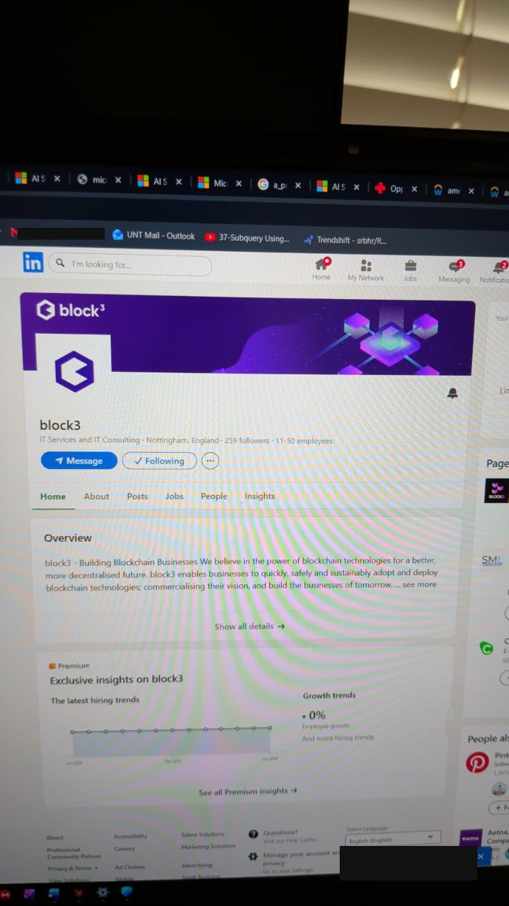

*Hollow "Block3" LinkedIn page (0% employee growth)*

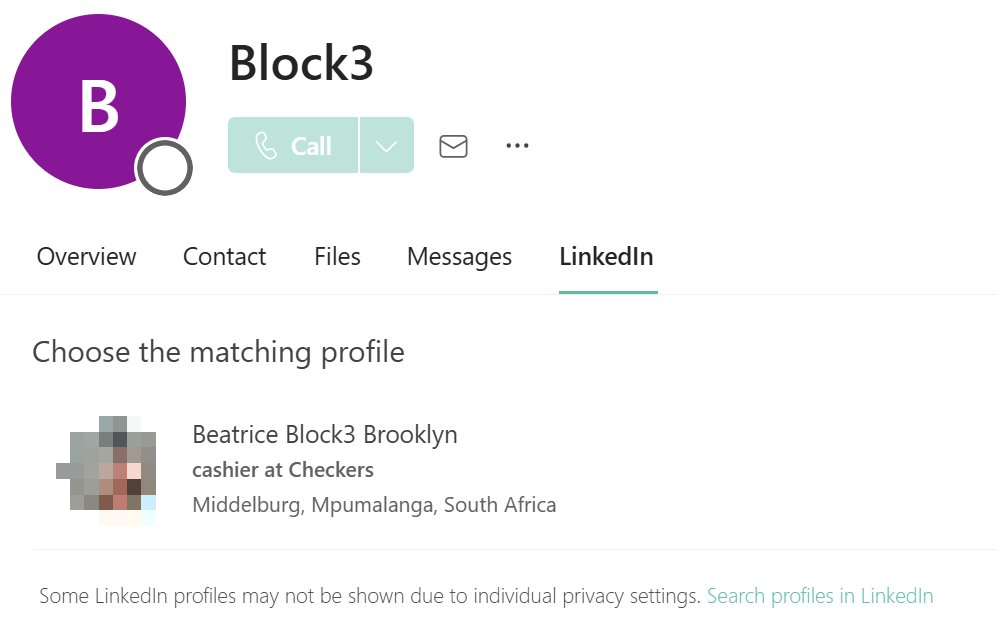

*Outlook contact enrichment — no real footprint*

### 2. Domain & infrastructure

| Property | `block3[.]co` (company) | `werknova[.]co` (meeting app) |
|---|---|---|
| Registrar | NICENIC INTERNATIONAL GROUP | NameCheap, Inc. |
| Creation date | **2026-04-30** (~6 weeks before contact) | **2026-06-09** (just **3 days** before the call) |
| Registry expiry | 2027-04-30 | 2027-06-09 (1-year, throwaway) |
| Nameservers | `BRYNNE` / `KOBE.NS.CLOUDFLARE.COM` | `BRYNNE` / `KOBE.NS.CLOUDFLARE.COM` |
| DNSSEC | unsigned | unsigned |
| Abuse contact | `abuse@nicenic.net` | `abuse@namecheap.com` |

**Both domains share the identical Cloudflare nameserver pair** — strong evidence of a single operator running one campaign. Brand-new, single-year registrations behind a CDN, with privacy-shielded registrant data, are textbook disposable phishing infrastructure.

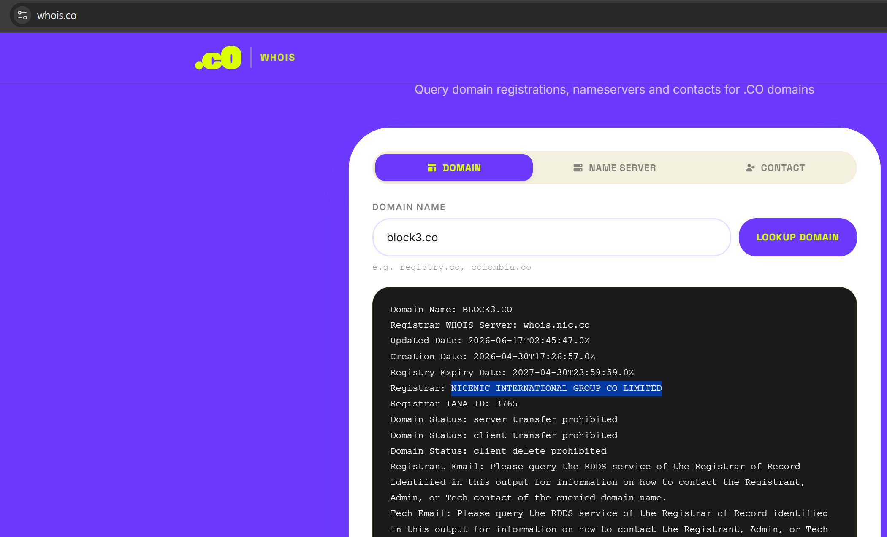

*WHOIS — block3[.]co (created ~6 weeks before contact)*

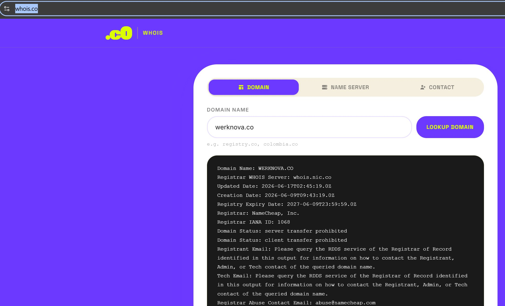

*WHOIS — werknova[.]co (created 3 days before the call)*

### 3. The payload — ACRStealer

| Artifact | Detail |
|---|---|
| Dropper | `werknova_setup.msi` (~109 MB; padding/bloat is a common AV/sandbox-evasion trick) |
| Dropper SHA-256 | `d59d3443120c77b1cf524a1926074dccbe9fa0ce2054f4b7962ec1301b8ca4c5` |
| Malicious DLL SHA-256 | `6671e91ed4e3e51601f256150f94585f551978a34199dcea665a5328a3f576aa` |
| Classification | **Infostealer / ACRStealer** |
| Loader technique | **DLL search-order hijacking / sideloading** via a legitimately-named `draw.io.exe` — which is why the firewall attributed the outbound C2 connection to `draw.io.exe` rather than to an obviously-malicious process |
| Hash reuse | The same dropper hash has been submitted under **other** fake-app names, e.g. `kollabit_setup.msi` (per Maltiverse) — confirming this is a **reusable, rebrandable kit**, not a one-off |
| Hybrid Analysis verdict | **Malicious**, Threat Score **80/100** |

**Capabilities** (per AhnLab ASEC and corroborating vendor reporting): ACRStealer is a C++ malware-as-a-service stealer (a GrMsk / "Amatera" lineage) that harvests **browser credentials and saved logins, session cookies, autofill, cryptocurrency wallets** (MetaMask, Trust Wallet, Exodus, Electrum, etc.), **FTP / remote-access creds** (FileZilla, AnyDesk, TeamViewer), **email and messaging app data** (Outlook, Thunderbird, Telegram, Signal, WhatsApp), **password-manager files** (Bitwarden, 1Password, KeePass), and **VPN credentials**. A config pulled from C2 defines exactly what to take.

It uses a **Dead Drop Resolver (DDR)**: the real C2 address is Base64-encoded and hidden on a legitimate service (Google Docs, Steam, telegra.ph, etc.), which the malware fetches before contacting the actual C2. This is relevant to the containment assessment below — perimeter blocking of one known-bad domain does not guarantee the malware could not resolve an alternate C2 through a trusted intermediary that a firewall would not block. Late-January-2026 builds further added ECDH + ChaCha20-Poly1305 encrypted C2, TLS comms, and syscall-based evasion (Heaven's Gate), indicating an actively maintained family.

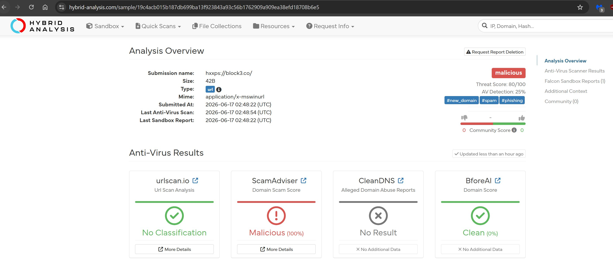

*Hybrid Analysis — block3[.]co malicious*

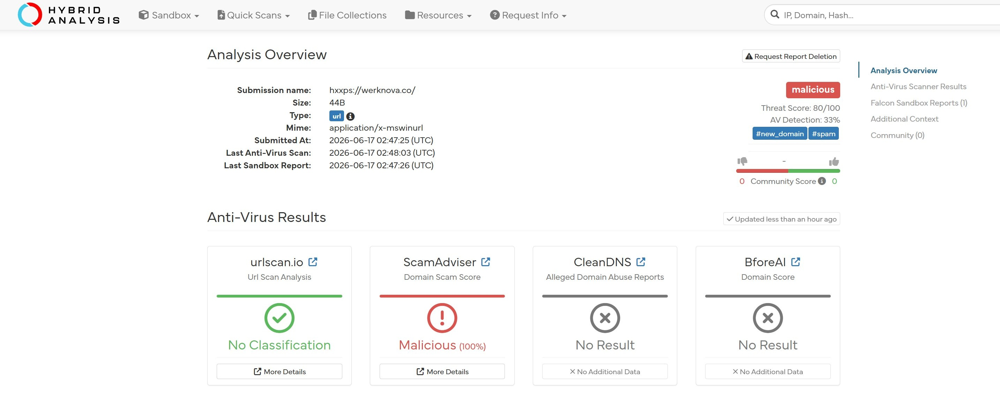

*Hybrid Analysis — werknova[.]co malicious*

### 4. Command-and-control / network behaviour

| Indicator | Detail |
|---|---|
| Primary C2 | `jarlontravon[.]com` → `104.21.33[.]210` (Cloudflare-fronted) |
| Detection | flagged **Phishing** by LevelBlue on VirusTotal; blocked by Trend Micro and Bitdefender |
| Additional contacted IPs (flagged) | `217.20.50[.]151`, `217.20.50[.]153` (AS20253) — blocked by Bitdefender Web Protection |
| Benign noise (do **not** report) | `repository.certum[.]pl`, `subca.ocsp-certum[.]com`, `*.ocsp-certum[.]com` — legitimate **Certum CA / OCSP** endpoints contacted for certificate-revocation checks. Distinguishing this benign infrastructure from the malicious C2 is part of the analysis. |

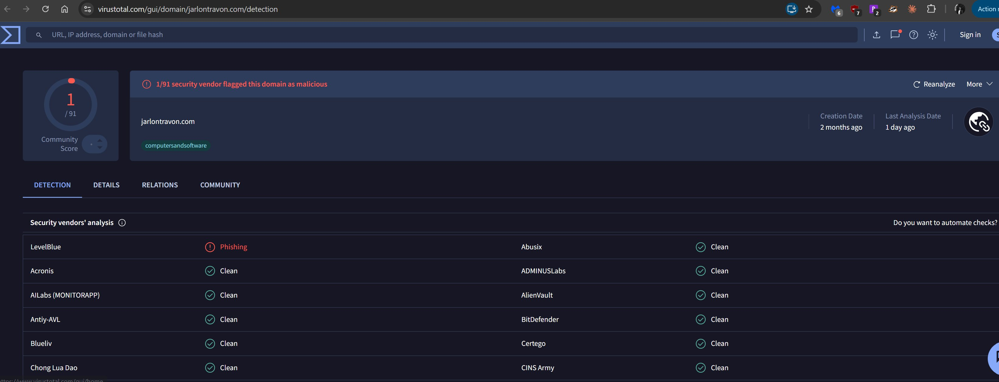

*VirusTotal detection for jarlontravon[.]com*

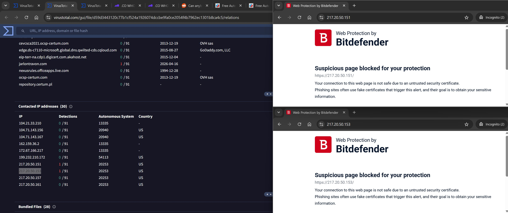

*Sample's contacted IPs + Bitdefender blocks*

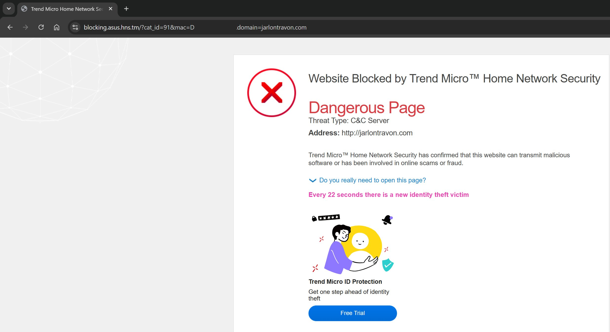

*Trend Micro "Dangerous Page — C&C Server" block*

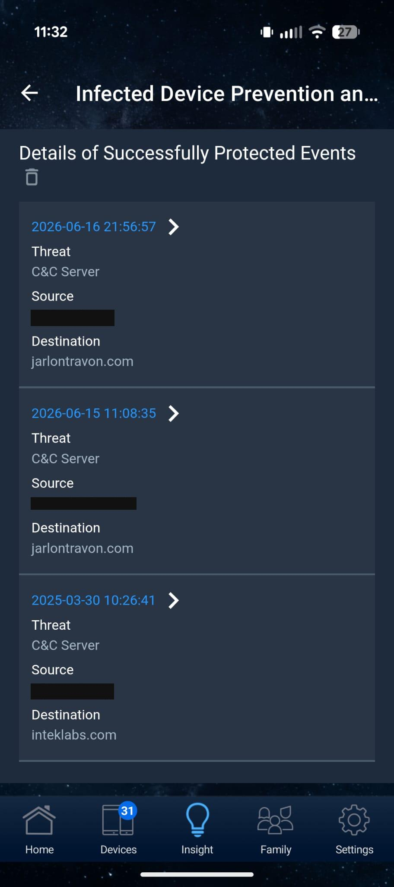

*Trend Micro app event log of C2 blocks*

### 5. Email authentication analysis

The lure email was parsed with a Message Header Analyzer:

- **SPF, DKIM, and DMARC all PASSED.** The message carried a valid DKIM signature for **both** `block3[.]co` **and** `amazonses[.]com`; SPF passed for `send.block3[.]co` (sender IP `23.251.234[.]58`); DMARC = `bestguesspass`. Body in **plain text**.
- Headers (`Message-ID`, `Received`, `X-SES-Outgoing`, `Feedback-ID: ...:AmazonSES`) confirm delivery via **Amazon SES** (`ap-northeast-1`, Tokyo region), through the Resend sending service.
- Sender identity: `emma.martin@block3[.]co`.

Rather than *skipping* authentication, the operator configured **valid** SPF/DKIM/DMARC through a reputable provider (Amazon SES) so the phishing email would pass authentication checks and reach the inbox instead of the spam folder — a more deliberate and sophisticated tactic than unauthenticated spoofing. Combined with the SES relay and a six-week-old sender domain, this remains a high-confidence phishing signal.

---

## MITRE ATT&CK mapping

| Tactic | Technique | In this incident |
|---|---|---|
| Resource Development | T1583.001 Acquire Infrastructure: Domains | Brand-new `block3[.]co`, `werknova[.]co/.app` on shared Cloudflare NS |
| Resource Development | T1585 Establish Accounts | Fake "Block3" LinkedIn page; "Emma Martin" persona |
| Initial Access | T1566.002 Phishing: Spearphishing Link | Recruiter email → booking/meeting links |
| Initial Access / Defense Evasion | T1656 Impersonation | Impersonation of a real "block3" brand and a recruiter |
| Execution | T1204.002 User Execution: Malicious File | `werknova_setup.msi` executed |
| Defense Evasion | T1574.001 Hijack Execution Flow: DLL Search-Order Hijacking | Payload sideloaded via `draw.io.exe` |
| Defense Evasion | T1027 / T1106 / T1620 Obfuscation, Native API, syscall evasion | MSI bloat; ACRStealer syscall/Heaven's-Gate evasion |
| Command & Control | T1102 Web Service (Dead Drop Resolver) | Real C2 resolved via a legitimate service |
| Command & Control | T1071.001 Application Layer Protocol: Web | Beacon to `jarlontravon[.]com` |
| Credential Access | T1555.003 Credentials from Web Browsers | Browser-saved logins targeted |
| Credential Access | T1539 Steal Web Session Cookie | Session-cookie theft (MFA bypass) |
| Collection / Exfiltration | T1005 / T1041 Data from Local System / Exfil over C2 | Wallets, files, config exfil to C2 |
| Impact | T1657 Financial Theft | Crypto / account-takeover monetization |

---

## Defensive analysis — which controls held

**Layers that held:**
- **Network-layer DNS/URL filtering (Trend Micro Home Network Security on the router)** blocked the C2 to `jarlontravon[.]com` — observed both live and on sandbox replay. This is the most likely reason exfiltration to that endpoint did not complete.
- **Bitdefender** independently blocked the secondary IPs (`217.20.50.151/153`).
- **AdGuard DNS** at the gateway and browser hardening (uBlock Origin and others) reduced exposure.

**Layers that did not:**
- **Microsoft Defender's full scan returned 0 findings** after a confirmed-malicious MSI executed. Endpoint AV signatures lag fresh, polymorphic, MaaS stealer builds. **A clean AV scan is not evidence of a clean machine.**

**Why the host is treated as compromised regardless of the block:**
1. The payload **executed** — `draw.io.exe` attempting the C2 beacon confirms code ran in the user context.
2. ACRStealer's **Dead Drop Resolver** design means a perimeter block of one domain does not guarantee it could not reach an alternate C2 via a trusted intermediary.
3. Infostealers act in **seconds**. Industry data (2026) shows **~31% of stolen credential sets include live session cookies that bypass MFA**, and credential-stuffing / business-email-compromise follow-on **typically appears within ~2 weeks** of a confirmed stealer infection.

For a confirmed infostealer execution, the only two defensible end-states are **(a) verified-clean via full rebuild** or **(b) assume-compromised and rotate everything**.

---

## Incident response actions

**Performed**
- Host disconnected from the network within minutes of execution.
- Dropper deleted; a copy of the sample preserved on isolated media for analysis.
- Defender full scan run (0 findings — recorded as non-conclusive).
- Host powered down and kept offline.
- Open-source investigation completed (WHOIS, VirusTotal, Hybrid Analysis, Maltiverse, header analysis).

**Recommended remediation (order matters)**
1. From a **separate, clean device**: revoke all active sessions ("sign out everywhere") and rotate credentials — **email first** (recovery anchor), then financial/brokerage, crypto, password manager, then the rest; enable passkeys/MFA.
2. **Wipe and clean-install** the OS from trusted boot media (preferred over in-place reset). Back up *data files only* — never executables.
3. Re-rotate the most critical credentials **after** rebuild; restore and re-scan data.
4. Enable fraud alerts / credit monitoring; watch for unexpected MFA prompts and password-reset emails.
5. Block and do not re-engage the sender; treat further "Block3 / Werknova / Emma Martin" contact as hostile.
6. Report the infrastructure (see [`REPORTING.md`](REPORTING.md)).

---

## Takeaways for job seekers and defenders

1. **A legitimate interview never requires installing a proprietary "meeting client."** Zoom, Teams, Google Meet, and Webex all run in-browser. "Install our app to fix your mic" is the payload-delivery step.
2. **"Windows or Mac?" is targeting, not courtesy** — it selects which OS-specific payload to serve (Windows RAT+stealer vs. macOS AMOS in parallel campaigns).
3. **Brand-new domains + shared Cloudflare NS + Amazon SES relay (with valid, freshly-configured SPF/DKIM/DMARC)** is a high-confidence phishing fingerprint verifiable in minutes.
4. **Endpoint AV is a backstop, not a guarantee.** Network-layer (DNS/URL) filtering did the heavy lifting here.
5. **For threat-hunting or baiting, never detonate on a primary device.** Use a disposable VM with snapshots, an isolated VLAN, and throwaway accounts with no real credentials present.
6. **Assume-breach is a posture, not panic.** Rotate credentials and rebuild; it is cheap insurance against the six-figure follow-on losses seen in this campaign class.

---

## How this maps to known campaigns

This mirrors documented, active 2025–2026 operations:

- **"Rogue meeting app" Web3 job scams** — Bitdefender documented fake interviews run through a bogus meeting client that serves a Windows RAT+infostealer (and macOS AMOS), unlocked by an **access code** — structurally identical to Werknova's room-code flow.
- **"Contagious Interview" / "ClickFake Interview"** (tracked by Microsoft, Sekoia, Palo Alto Unit 42) — fake recruiters drive job seekers (often crypto/Web3) to run a "tool" or "assessment" that drops stealers/backdoors. One documented front company in that ecosystem was named **"BlockNovas"** — a naming style notably close to **"Block3" / "Werknova."**
- **ACRStealer-as-a-service** — because the dropper is a rebrandable MaaS kit (same hash, multiple app names), the lure brand is disposable and will reappear under new names.

**Attribution note:** ACRStealer is commodity malware-as-a-service used by many actors. The evidence supports a **financially-motivated infostealer campaign** consistent with the rogue-meeting-app pattern; it does **not**, on its own, establish a specific named threat group. The resemblances are noted, not claimed as attribution.

---

## Indicators of Compromise (IOCs)

Full, copy-pasteable list in **[`IOCs.md`](IOCs.md)**. Summary:

| Type | Indicator (defanged) |
|---|---|
| Domain (company / phishing) | `block3[.]co` |
| Domain (rogue meeting app) | `werknova[.]co`, `werknova[.]app` |
| URL (malware delivery) | `hxxps://werknova[.]co/download` |
| Domain (C2) | `jarlontravon[.]com` |
| IP (C2) | `104.21.33[.]210` |
| IP (secondary, flagged) | `217.20.50[.]151`, `217.20.50[.]153` |
| File | `werknova_setup.msi` (aka `kollabit_setup.msi`) |
| SHA-256 (dropper) | `d59d3443120c77b1cf524a1926074dccbe9fa0ce2054f4b7962ec1301b8ca4c5` |
| SHA-256 (payload DLL) | `6671e91ed4e3e51601f256150f94585f551978a34199dcea665a5328a3f576aa` |
| Sender | `emma.martin@block3[.]co` (Amazon SES, ap-northeast-1) |
| Access/room code | `YU-FPHR-FMN6` |
| Malware family | Infostealer / **ACRStealer** |

---

## Screenshots

Evidence from the investigation (personal identifiers and third-party faces redacted; attacker indicators preserved).

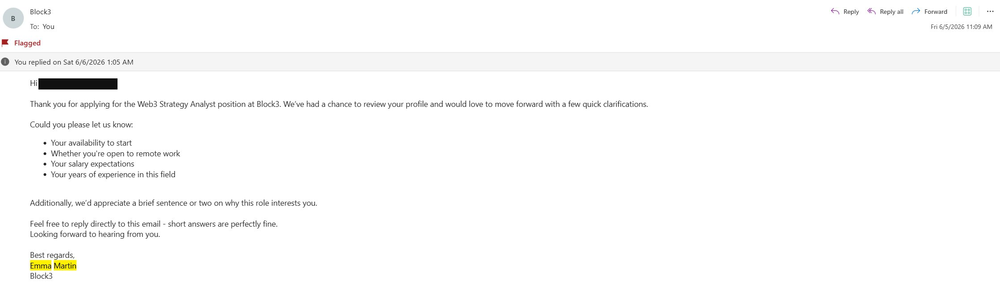

*First "Block3 / Emma Martin" recruiting email*

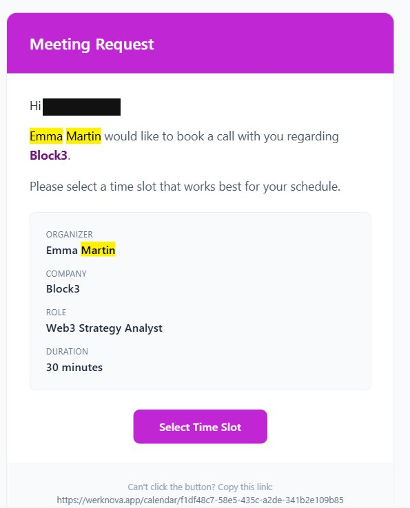

*"Meeting Request" booking link on werknova[.]app*

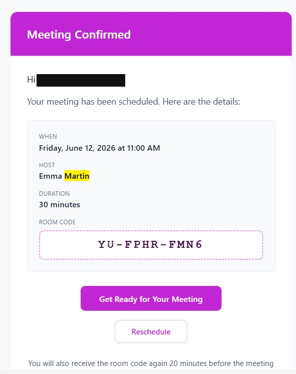

*"Meeting Confirmed" with access code YU-FPHR-FMN6*

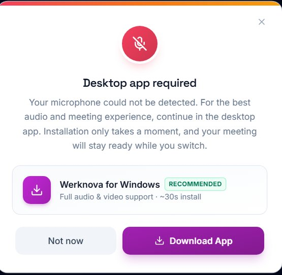

*The "mic not detected — install desktop app" lure*

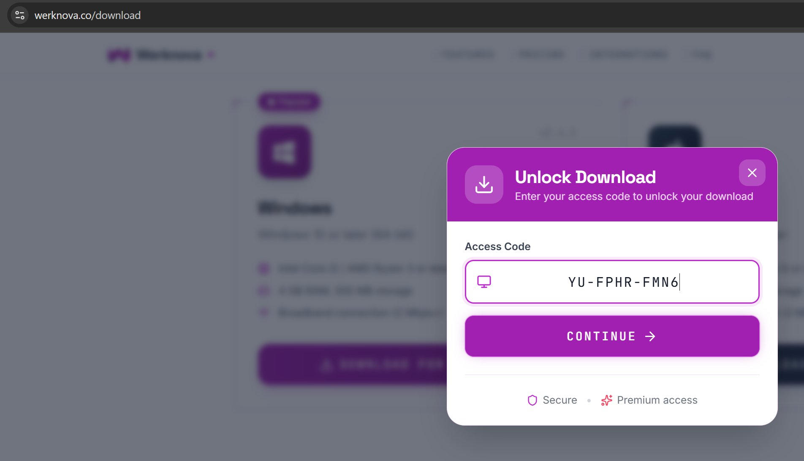

*werknova[.]co/download access-code gate*

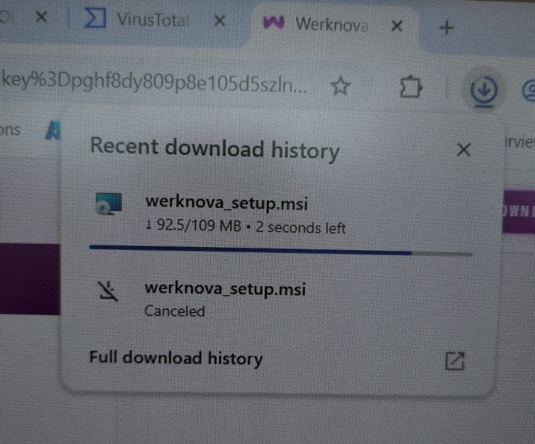

*Browser download of werknova_setup.msi*

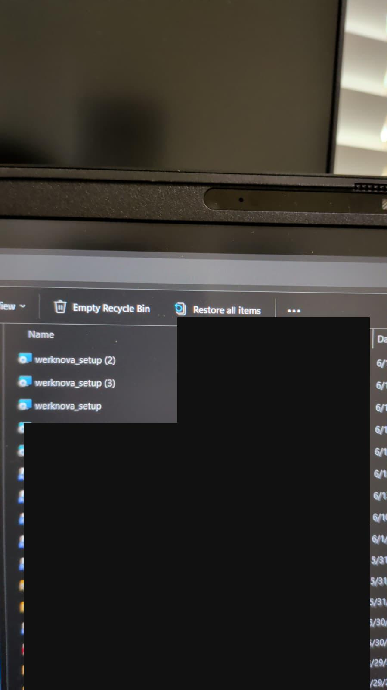

*Dropper deleted to Recycle Bin*

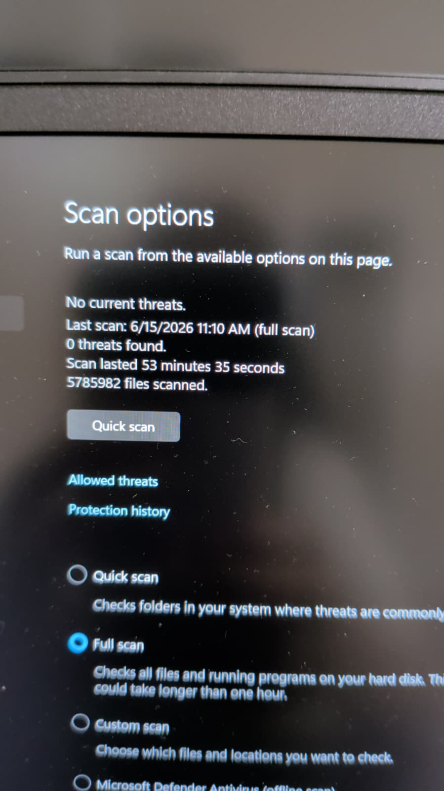

*Microsoft Defender full scan — 0 threats found*

*Trend Micro "Dangerous Page — C&C Server" block*

*Trend Micro app event log of C2 blocks*

*VirusTotal detection for jarlontravon[.]com*

*Sample's contacted IPs + Bitdefender blocks*

*Hybrid Analysis — block3[.]co malicious*

*Hybrid Analysis — werknova[.]co malicious*

*WHOIS — block3[.]co (created ~6 weeks before contact)*

*WHOIS — werknova[.]co (created 3 days before the call)*

*Hollow "Block3" LinkedIn page (0% employee growth)*

*Outlook contact enrichment — no real footprint*

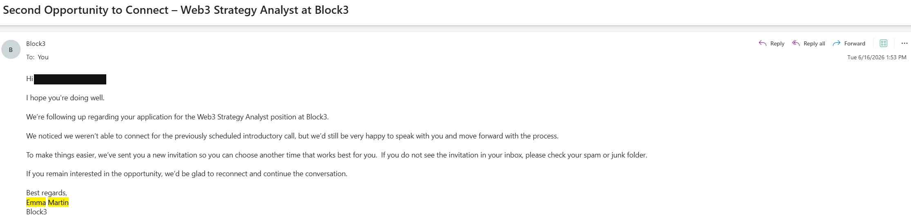

*"Second Opportunity to Connect" re-engagement (1)*

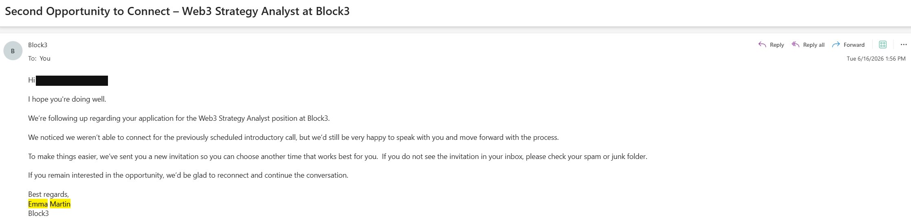

*"Second Opportunity to Connect" re-engagement (2)*

---

## References

- AhnLab ASEC — ACRStealer / Dead Drop Resolver analyses and 2026 variant updates.
- Palo Alto Unit 42 / Sekoia / Microsoft Defender Experts — Contagious Interview / ClickFake Interview fake-job campaigns.
- Bitdefender — fake job interviews defrauding Web3 job seekers (rogue meeting-app + access-code pattern).
- Proofpoint — ACRStealer / Amatera Stealer lineage.
- abuse.ch — URLhaus / MalwareBazaar / ThreatFox (community IOC sharing).
- VirusTotal, Hybrid Analysis, Maltiverse — sample and infrastructure analysis.

---

*Published to help other job seekers recognize this pattern. If it saved you from clicking "install," pass it on.*
